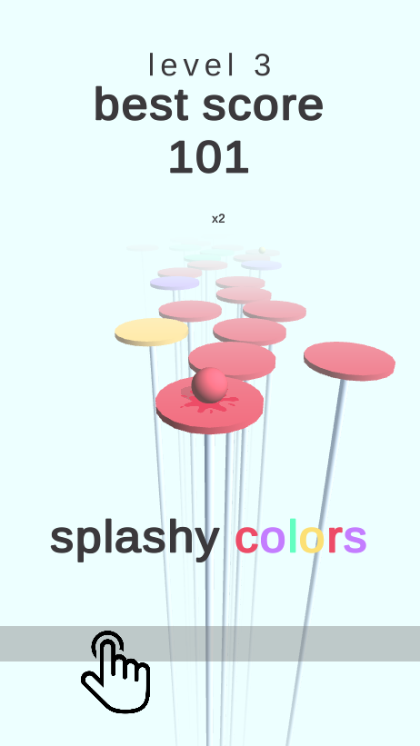

# Splashy Colors

An original mobile hypercasual game created using Unity.

The basic idea is as follows: the player controls a ball that jumps over the platforms of different colors and avoids platforms that don't match the ball color. If the colors match, the player gets the score points. The main goal is to get as many points as possible.

* [Gameplay video](https://drive.google.com/open?id=1jHc-vqV6KbL2LeQDrAnW8PUg4DUkVpLh)
* [Android build](https://drive.google.com/open?id=1NyE29Xv6pwXNIJ0qACIey8TPNJ7G76vQ)
